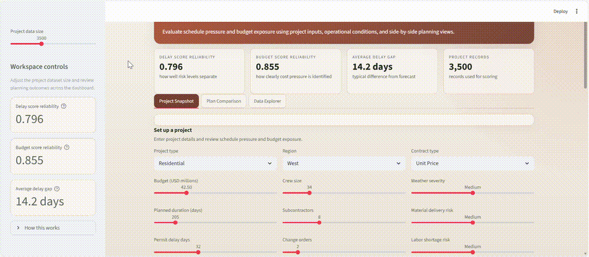
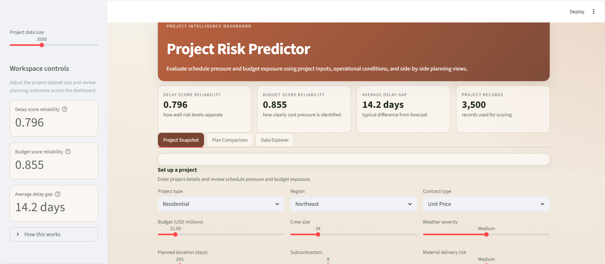
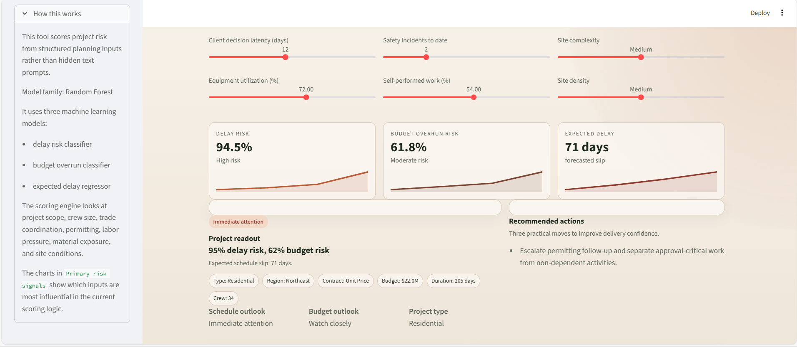
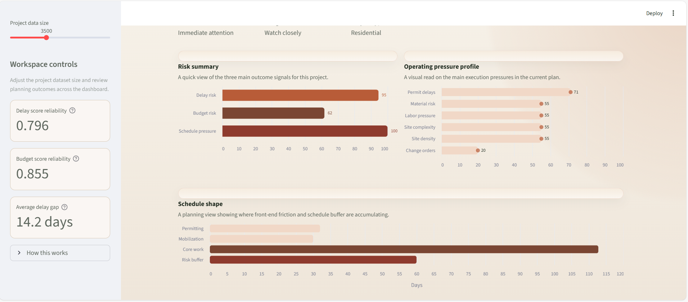
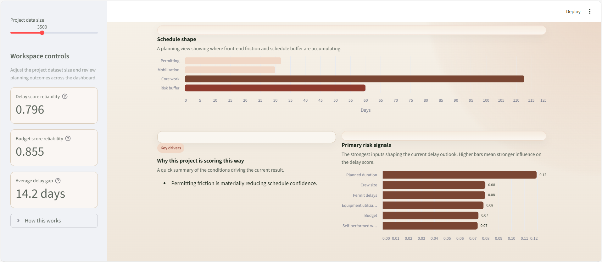

# Project Risk Predictor

Interactive ML dashboard for predicting schedule delays and budget overruns from project planning data.

## Demo



## Overview

Project Risk Predictor is a Streamlit dashboard that scores project delivery risk from structured planning inputs. It is designed around construction-style project data, but the workflow generalizes well to capital projects, operations, logistics, and delivery planning.

The app helps users:

- estimate delay risk
- estimate budget overrun risk
- forecast expected delay days
- compare plan changes with what-if analysis
- inspect the strongest inputs shaping each score

## Product Highlights

- Clean dashboard interface with scenario inputs, planning readouts, and comparison views
- Explainable scoring with visible risk signals and a built-in "How this works" section
- Multiple charts for schedule pressure, operating pressure, plan comparison, and delay distribution
- Full demo media included for GitHub presentation

## Model Approach

The scoring engine uses three scikit-learn Random Forest models:

- `RandomForestClassifier` for delay risk
- `RandomForestClassifier` for budget overrun risk
- `RandomForestRegressor` for expected delay days

The pipeline includes:

- median imputation and scaling for numeric features
- most-frequent imputation and one-hot encoding for categorical features
- feature importance outputs for explainability

## Inputs

The dashboard uses structured project inputs such as:

- project type, region, and contract type
- budget and planned duration
- crew size and subcontractor count
- change orders and safety incidents
- permit delays and client decision latency
- weather severity, material risk, and labor pressure
- site complexity, site density, self-performed work, and equipment utilization

## Screenshots

### Dashboard Overview



### Snapshot Detail



### Risk Charts



### Signal View



## Run Locally

```bash
pip install -r requirements.txt
streamlit run app.py
```

If you are using the shared workspace virtual environment:

```bash
C:\Users\rsamsami\Documents\Playground\.venv\Scripts\python.exe -m streamlit run app.py
```

## Repo Structure

- `app.py` - Streamlit dashboard
- `src/project_risk_predictor/data.py` - project data generator and default inputs
- `src/project_risk_predictor/modeling.py` - preprocessing, training, metrics, and prediction helpers
- `assets/media/` - demo media
- `assets/screenshots/` - README screenshots

## GitHub Description

Interactive ML dashboard for predicting schedule delays and budget overruns from project planning data.
